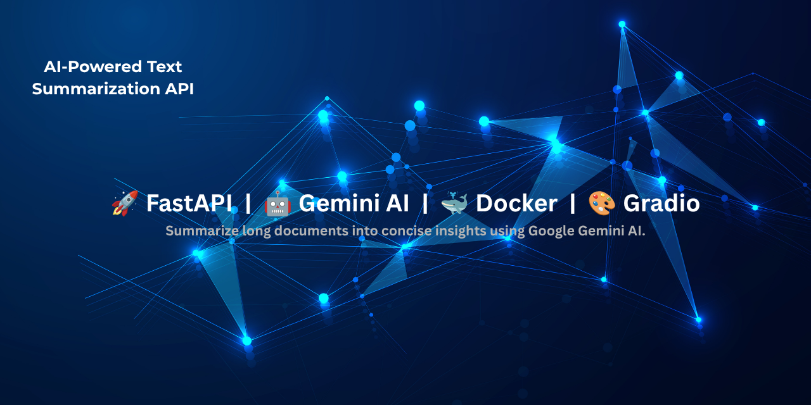
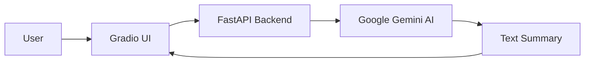

<p align="center">
  
</p>

<p align="center">


</p>

# 🚀 AI-Powered Text Summarization API

## 📖 Project Overview

This project is an AI-powered Text Summarization API developed using **FastAPI**, **Google Gemini AI**, **Docker**, and **Gradio**. It enables users to summarize lengthy text into concise and meaningful summaries through an intuitive web interface or REST API.
The application demonstrates modern Generative AI application development by integrating Large Language Models (LLMs) with API development and containerization technologies.
---

## ✨ Features
- AI-powered text summarization
- FastAPI REST API
- Interactive Gradio user interface
- Google Gemini AI integration
- Docker support
- Docker Compose support
- Clean modular project structure
- Easy deployment
---

## 🏗️ Architecture


## ⚙️ Workflow

1. User enters text in the Gradio UI.
2. FastAPI receives the request.
3. FastAPI sends the prompt to Google Gemini AI.
4. Gemini generates a concise summary.
5. FastAPI returns the response.
6. Gradio displays the summarized text.

## 🛠️ Technology Stack
- Python
- FastAPI
- Google Gemini AI
- Gradio
- Docker
- Docker Compose
---

## 📂 Project Structure
```text
docker-summarizer-api/
│
├── main.py
├── gradio_app.py
├── Dockerfile
├── docker-compose.yml
├── requirements.txt
├── pyproject.toml
├── .gitignore
└── README.md
```

## ⚙️ Installation
Clone the repository
```bash
git clone https://github.com/Manojnuka/docker-summarizer-api.git
```

Move into the project
```bash
cd docker-summarizer-api
```
Install dependencies

```bash
pip install -r requirements.txt
```

## ▶️ Run FastAPI

```bash
uvicorn main:app --reload
```

## ▶️ Run Gradio Interface

```bash
python gradio_app.py
```

## 🐳 Run using Docker
```bash
docker-compose up --build
```
## 📂 API Endpoint

| Method | Endpoint | Description |
|--------|----------|-------------|
| POST | `/summarize` | Summarize input text using Google Gemini AI |

## 📌 Future Enhancements
- PDF Summarization
- Multi-language Support
- Speech Summarization
- Document Upload
- Authentication
- Cloud Deployment
---

## 👨‍💻 Author
**Manoj Kumar Nukathoti**

Generative AI | Python | FastAPI | Docker | LLM Applications

## 📄 License

This project is licensed under the MIT License.
